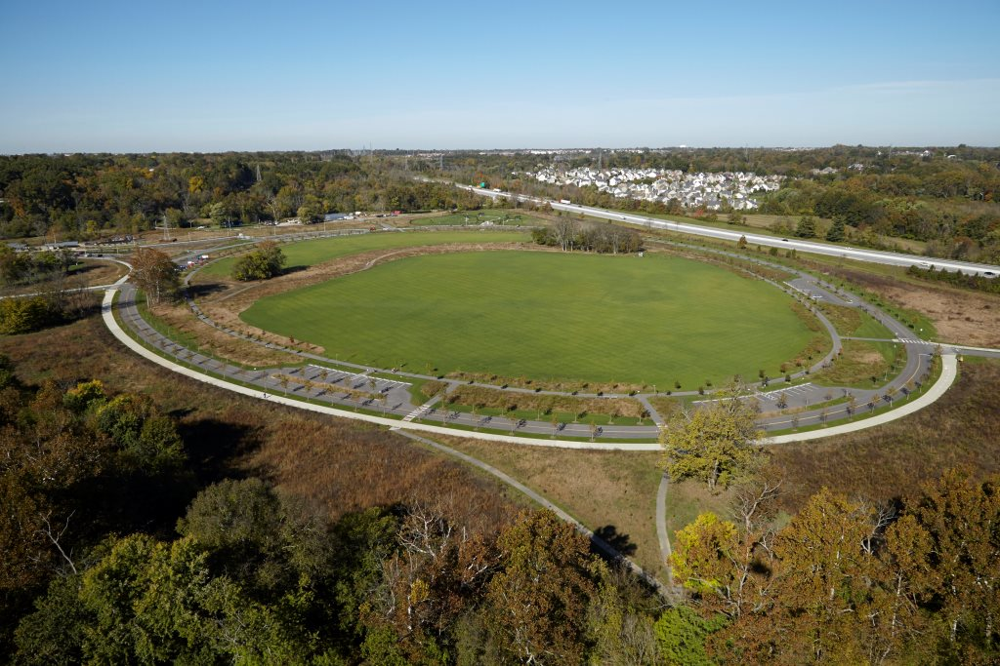
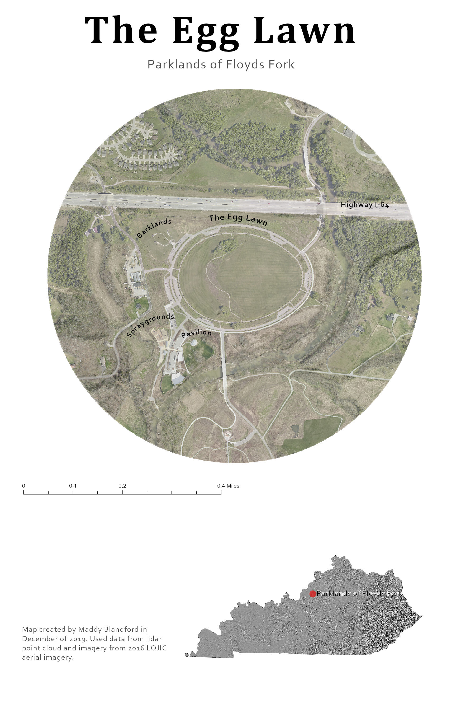
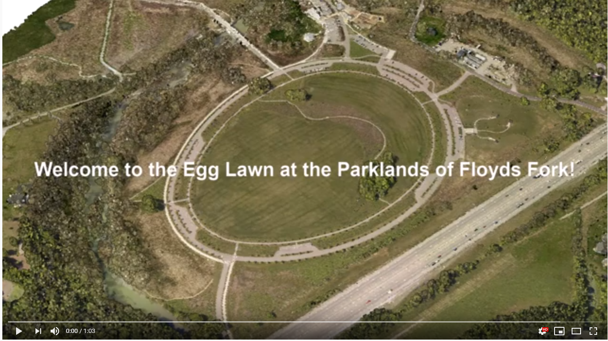
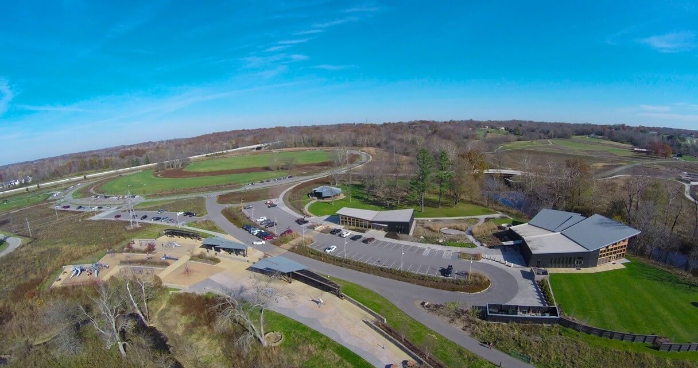
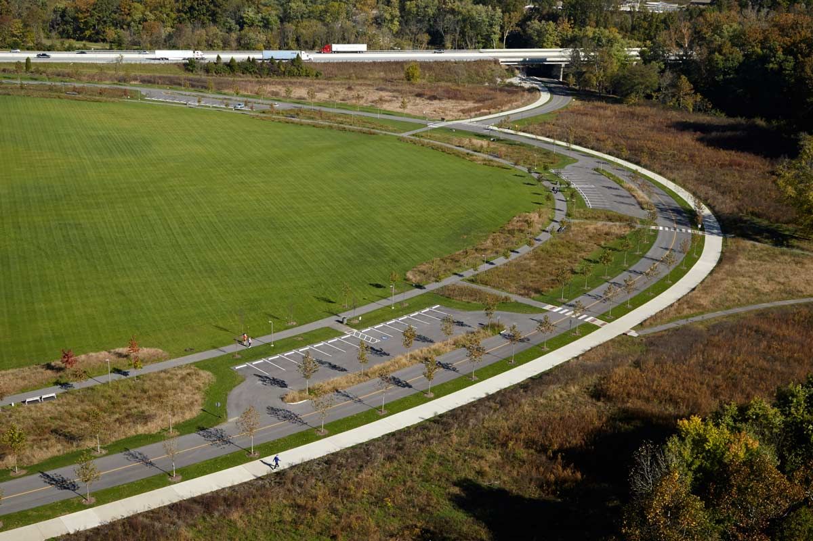

# The Egg Lawn at the Parklands of Floyds Fork

## Area around the Egg Lawn

*Aerial view of the Egg Lawn at the Beckley Creek Park*

## Introduction 

It is located inside Beckley Creek Park in Louisville, KY. The Egg Lawn alone is 22 acres. Construction started on the parks in 2011 and opened in November 2012. It is just one small part of four major parks in Louisville all connected by a park drive, a trail system, and a water trail. A quick summary of the master plan of the Parklands includes:
- 100 miles of trails for biking, walking, etc.
- 19 miles for canoeing on the Floyds Fork Creek
- Locations to host events such as the PNC Achievement Center and the Gheens Foundation Lodge which are both located next to the Egg Lawn
- Playgrounds and sprayground for families
- Dog parks called the "Barklands"

### Base Map

*Location of the Egg Lawn*

### Video Exploration
This video shows an animated point cloud of the Egg Lawn path and surrounding areas. The camera flows and aerial view around the park then moves to surrounding locations such as the "Barklands", the Gheens Foundation Lodge, and the PNC Achievement Center

*Video Exploration of the park (Watch video: https://www.youtube.com/watch?v=v284A9q7axY&feature=youtu.be)*
## Photographs

*This image gives a side view of the Egg Lawn. In this frame, it also shows the sprayground, achievement center, and the foundation lodge. Photo by: Kelley Construction*

*This photogrpah gives a closer look of the Egg Lawn. You are able to see both the parking lot and the path surrounding the lawn. Photo by: Landezine Architecture Platform*

## Sources and Tools

This project was created by Maddy Blandford, a senior graduating with a Bachelor's of Arts in Geography with minors in GIS/Mapping and International Studies. It was made for a class called GEO 409: Advanced GIS at the University of Kentucky Department of Geography. The date of analysis started on December 10, 2019.

Color aerial imagery was found on the Louisville/Jefferson County Information Consortium (LOJIC) stored on public FTP server which is maintained by multiple agencies in Louisville, Kentucky such as the local government, the Metropolitan Sewer District (MSD), the Property Valuation Administration (PVA), and the Louisville Water Company. 

ArcGIS Pro lidar and digital surfaced model tools were used to process and analyze the data. 